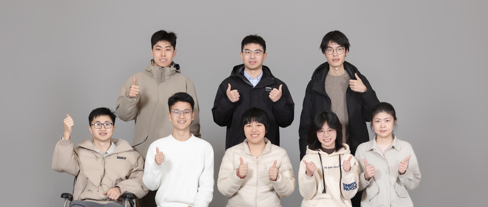

 

# Electrochemical Energy & Sustainable Materials Lab @ University of Macau

Our group develops advanced materials, interfaces, and electrolyte chemistries for sustainable energy storage and beyond, bridging fundamental mechanistic understanding with application-driven materials design and engineering.

## Research Areas

- Aqueous Zinc Batteries
- Redox Flow Batteries
- Application-Oriented Lithium-Ion Battery Materials
- Sustainability-Driven Interdisciplinary Research

## Contact

- Email: liqing@um.edu.mo
- Affiliation: Institute of Applied Physics and Materials Engineering, University of Macau

## Website

Visit our website: [https://chuxue-hu.github.io/Electrochemical-Energy-Sustainable-Materials-Lab-Webpage/](https://chuxue-hu.github.io/Electrochemical-Energy-Sustainable-Materials-Lab-Webpage/)
